  

<h3><code>muzammil@github ~ $ whoami</code></h3>
<table>
  <tr>
    <td valign="top"></td>
    <td valign="top"></td>
  </tr>
</table>

 

<h3><code>muzammil@github ~ $ ./contributions.sh</code></h3>

  

<h3><code>muzammil@github ~ $ ls -la ~/projects</code></h3>

**Live links:** [AI Quiz Platform](https://quizapplicationmuzammil.netlify.app) &nbsp;•&nbsp; [WorldAtlas](https://worldatlas-website.netlify.app) &nbsp;•&nbsp; [SMIT UI Clone](https://smitwebsiteclone.netlify.app) &nbsp;•&nbsp; more on [my GitHub](https://github.com/MuhammadMuzammil-TheDeveloper?tab=repositories)

  

<h3><code>muzammil@github ~ $ cat skills.txt</code></h3>

  

